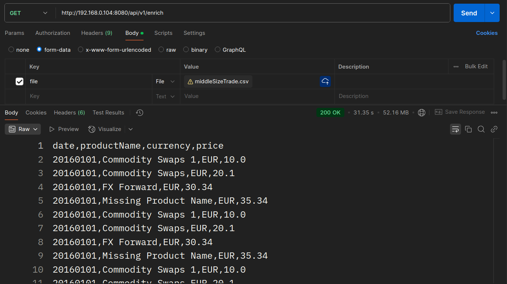
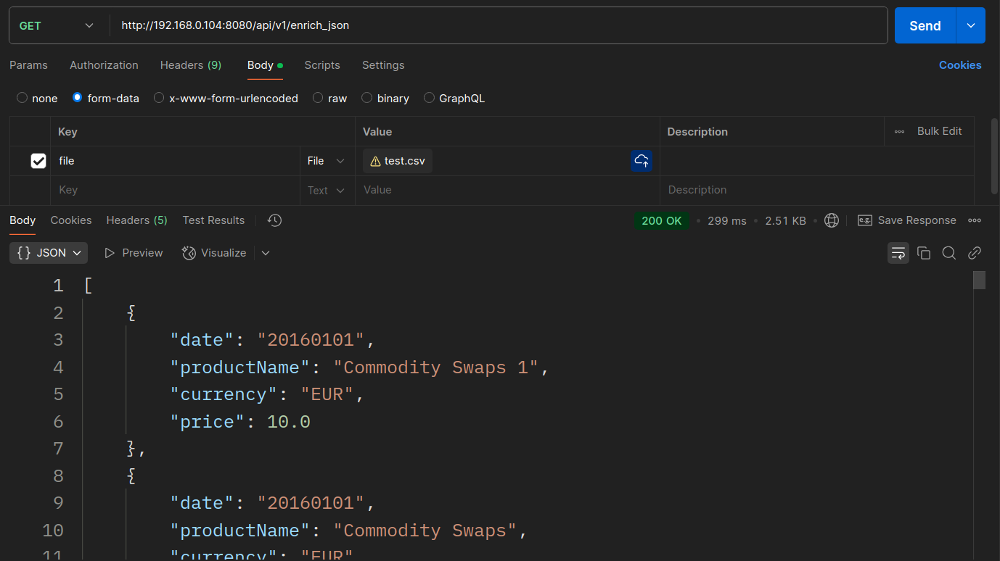

# Trade data API

## Run instructions

- Create .env file and specify REDIS_HOST, REDIS_PORT and REDIS_PASSWORD there
- Navigate to the project directory:
    ```bash
  cd trade-data-api
- Install the required dependencies:
    ```bash
  mvn install

## Usage

- Run the server using:
    ```bash
  mvn spring-boot:run

After starting the server, you can interact with the Trade Data API using the following endpoints:

## Design

- There are two files inside `src/main/resources/data`. `largeSizeProduct.csv` stores product names which is used to
  fill Redis DB with data. `testProductNames.csv` is used for testing
- Clean design with standard MVC structure
- src/main/kotlin/org/example/tradedataapi/infrastructure/shutdown contains a code when the server is being shut down (
  disconnect from database in our case)

### Enrich JSON Data

- **Endpoint**: `/api/v1/enrich_json`
- **Method**: `GET`
- **Parameters**:
    - `file`: The CSV file containing the trade data (multipart file).
- **Description**: This endpoint enriches the provided CSV file and returns the enriched data in JSON format.

### Enrich SCV file

- **Endpoint**: `/api/v1/enrich`
- **Method**: `GET`
- **Parameters**:
    - `file`: The CSV file containing the trade data (multipart file).
- **Description**: This endpoint enriches the provided CSV file and returns the enriched data in CSV format.

#### Example Request

You can use a tool like `curl` or Postman to test this endpoint. Here are examples using `curl`:

- Run the server using:
    ```bash
  curl -X GET "http://localhost:8080/api/v1/enrich_json" -F "file=@path/to/your/file.csv"

- or

  ```bash
  curl -X GET "http://localhost:8080/api/v1/enrich" -F "file=@path/to/your/file.csv"

## Code limitations:

- `/api/v1/enrich_json` might not work with a huge amount of data

### Tasks done:

- Reading data from `.csv` file using multiple flows
- Filtering all the entries by whether the date is in correct format
- Adding controllers for handling requests
- Writing and reading result from Redis database
- Forming a response into `.csv` or `JSON` format
- Implemented tests

## Testing results in Postman:

For testing with a huge amount of data, I recommend to set Max response size to at least 200 MB inside Postman settings
- `api/v1/enrich_json`:
- 
- `api/v1/enrich_json`:
- 


## Future ideas

- Host the project on the remote server, so that it can be available anywhere
- Add more tests that cover more specific cases
- Improve logging for cases when the provided date is in the wrong format
- Fix the problem, where `java.lang.OutOfMemoryError: Java heap space` error occurs when providing a huge amount of data
  to `api/v1/enrich_json` endpoint